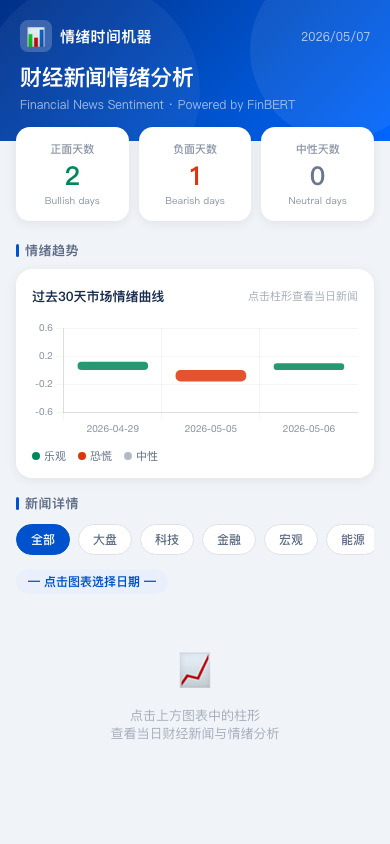
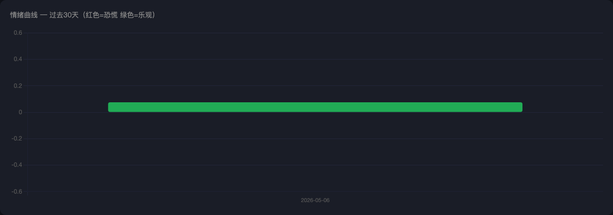

# 新闻情绪时间机器

> 用 FinBERT 分析财经新闻情绪，在交互式时间轴上可视化市场恐慌与乐观。


*(截图占位符 — 运行后替换为实际截图)*

---

## 功能特性

- **自动抓取新闻** — 通过 NewsAPI 按关键词拉取最近 30 天英文财经新闻
- **FinBERT 情绪分析** — 使用 `ProsusAI/finbert` 对每条标题打分（正面 / 中性 / 负面）
- **每日情绪汇总** — 将逐条分数聚合为日均情绪曲线
- **交互式仪表盘** — 点击柱状图任意日期，右侧展示当天 Top 10 标题及情绪评分
- **深色 UI** — 基于 Chart.js 的响应式深色主题网页

---

## 界面预览

| 情绪曲线 | 当天标题面板 |
|----------|-------------|
|  |  |

*(运行项目后截图替换)*

---

## 快速开始

### 1. 克隆仓库

```bash
git clone https://github.com/Wu123-123/news-sentiment-machine.git
cd news-sentiment-machine
```

### 2. 安装依赖

```bash
pip install -r requirements.txt
pip install transformers torch
```

> 首次运行会自动下载 FinBERT 模型（约 400 MB），请确保网络畅通。

### 3. 配置 API Key

在项目根目录创建 `.env` 文件：

```
NEWS_API_KEY=your_newsapi_key_here
```

免费 API Key 申请：[newsapi.org](https://newsapi.org)

---

## 使用方法

### Step 1 — 抓取新闻

```bash
python3 -c "
from src.fetch_news import fetch_news
fetch_news('stock market', days=30)
fetch_news('nasdaq', days=30)
"
```

生成文件：`data/news_<keyword>_<date>.csv`

### Step 2 — 情绪分析

```bash
python3 -c "
from src.analyze import analyze_file
import glob
files = [f for f in glob.glob('data/news_*.csv') if '_analyzed' not in f and '_daily' not in f]
for f in files:
    print('分析:', f)
    analyze_file(f)
"
```

生成文件：
- `data/news_*_analyzed.csv` — 逐条情绪分数
- `data/news_*_daily.csv` — 每日均值汇总

### Step 3 — 启动 Web 仪表盘

```bash
python app.py
```

访问 **http://localhost:8080**

---

## 项目结构

```
news-sentiment-machine/
├── app.py                  # Flask 主程序，提供 Web 界面和 API
├── src/
│   ├── fetch_news.py       # NewsAPI 新闻抓取
│   └── analyze.py          # FinBERT 情绪分析
├── templates/
│   └── index.html          # 前端仪表盘（Chart.js）
├── data/                   # 抓取 & 分析结果（自动生成）
├── requirements.txt
└── .env                    # API Key（不提交到 Git）
```

---

## API 端点

| 端点 | 说明 |
|------|------|
| `GET /` | 仪表盘主页 |
| `GET /api/data` | 返回全部每日情绪数据（JSON） |
| `GET /api/headlines?date=YYYY-MM-DD` | 返回指定日期 Top 10 标题 |

---

## 技术栈

| 层次 | 技术 |
|------|------|
| 数据获取 | [NewsAPI](https://newsapi.org) + `requests` |
| 情绪模型 | [FinBERT](https://huggingface.co/ProsusAI/finbert)（`transformers`） |
| 数据处理 | `pandas` |
| Web 框架 | `Flask` |
| 前端可视化 | [Chart.js 4.4](https://www.chartjs.org) |
| 运行环境 | Python 3.10+ |

---

## 注意事项

- NewsAPI 免费计划每天限 100 次请求，`pageSize` 最大 100 条
- FinBERT 仅支持英文文本，中文标题请先翻译
- `.env` 已加入 `.gitignore`，请勿将 API Key 提交到仓库

---

## License

MIT
